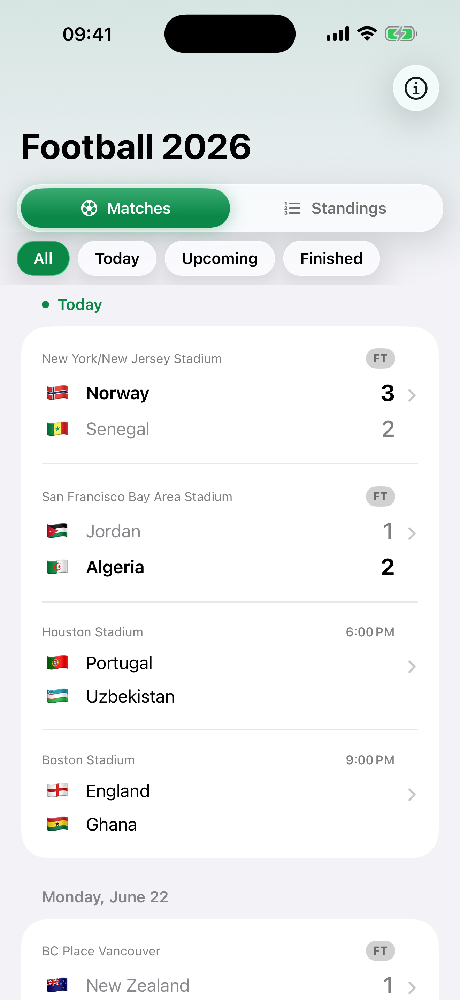
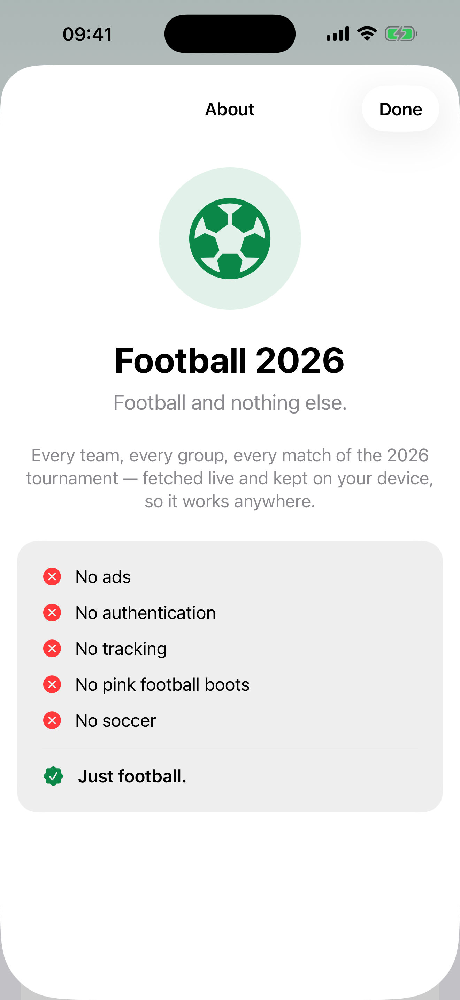
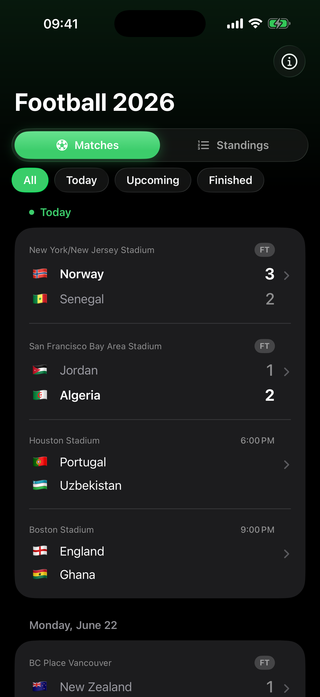
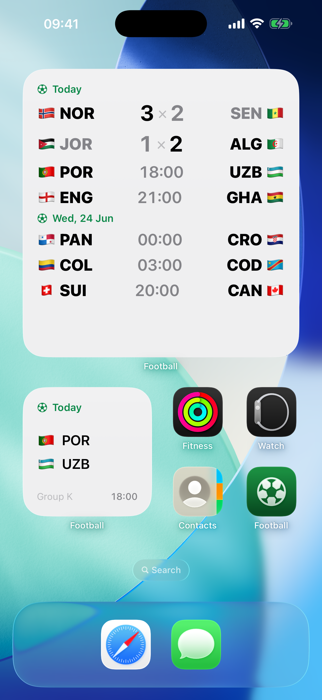
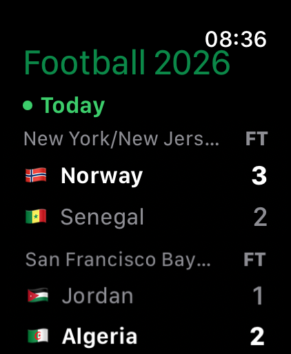

# Just Football ⚽

**The 2026 tournament, nothing else.**

The simplest way to follow the 2026 international football tournament on iOS: all 48 teams, all 12 groups, and every one of the 104 matches — from the opening kickoff to the final.

No ads. No accounts. No tracking. Just football.

| Schedule | About | Dark mode |
|---|---|---|
|  |  |  |

| Home Screen widgets | Apple Watch |
|---|---|
|  |  |

## Features

- Every match, grouped by day — live games float to the top, today is pinned, and completed days read latest-first
- Kickoff times shown in your time zone
- Live matches flagged the moment they start, with the running match clock, and final scores as soon as the whistle blows
- Live scores and goals refresh on their own while a match is in play — no need to pull
- Tap any match for its goal-by-goal timeline: scorer, minute, and penalty/own-goal markers
- Every stage clearly labelled, from the group phase to the final, with venues
- Works offline — the schedule lives on your device and refreshes when you open the app
- **Home Screen widgets** in three sizes — flag, country code, and score per team. The small widget follows the match that matters now (live, else the next one up); the medium and large show today's fixtures, or a team you follow with its last results and upcoming games. Group-stage matches show the group letter. They refresh on their own and update when you open the app.
- **Live Activities** on the Lock Screen and Dynamic Island that track a match in play, with the live score and match clock — both teams shown in the compact island, and never stacking duplicate cards
- **Tap to open** — tapping a widget or Live Activity jumps straight to that match's detail
- **Background refresh** keeps widgets and Live Activities current even while the app is closed
- A **Liquid Glass** interface — section switcher and filter chips that feel at home on iOS 26
- Localized in English and Brazilian Portuguese

## The manifesto

The main idea here is football and nothing else. No ads. No authentication. No tracking. No pink football boots. No soccer. Just football.

## Architecture

A SwiftUI + MVVM app, with all logic split into four local Swift packages under `Packages/`. The app target holds only views, view models, and glue.

```
football/            App target — Views, ViewModels, Support
Packages/
├── FootballCore     Domain models (Team, Match, Goal, Stage, ContentLocale)
├── FootballAPI      Airtable REST client
├── FootballStorage  SwiftData local cache (FootballStore model actor)
└── FootballManager  Sync & service layer tying API and storage together
```

Data flows one way: `FootballAPI` fetches public tournament data over HTTPS, `FootballManager` syncs it into `FootballStorage`, and the UI reads from the local store — which is why the app works offline.

The **Home Screen widget** (`footballWidget`, a WidgetKit app extension) reads the same data through an App Group (`group.app.zeneto.football`): the iOS app stores its SwiftData copy in the shared group container, and the widget reads it — plus does its own lightweight Teams/Matches refresh on its timeline so it stays current even when the app is closed. The app reloads the widget and updates any **Live Activity** after each sync. The Watch app keeps its own private store.

UI strings are localized with String Catalogs (en, pt-BR); match and team names come localized from the data source, falling back to English.

## Building

Requires Xcode with the iOS 26 SDK.

1. Clone the repo and open `football.xcodeproj`.
2. The app reads its data from an Airtable base with three tables, `Teams`, `Matches`, and `Goals`. Credentials are kept out of git:

   ```sh
   cp football/Support/Secrets.swift.sample football/Support/Secrets.swift
   ```

   Then fill in your Airtable base ID and a personal access token with the read-only `data.records:read` scope.
   The widget target needs the same file at `footballWidget/Support/Secrets.swift` (a `Secrets.swift.sample` is provided there too). Running `ci_scripts/ci_post_clone.sh` with the two environment variables set generates all three at once.
3. Build and run. SwiftUI previews render against bundled sample data (`PreviewFootballService`) with no credentials, but the **app and widget targets** need `Secrets.swift` to compile — it defines `AirtableConfiguration.current`, which `AppDependencies` / `WidgetDependencies` read.

### Continuous integration (Xcode Cloud)

The iOS app, the Watch app, and the widget extension each read their credentials
from a git-ignored `Secrets.swift` (`football/Support/`, `footballWatch/Support/`,
and `footballWidget/Support/`), so CI has to supply them another way.
`ci_scripts/ci_post_clone.sh` regenerates **all three** files at build time from
two **secret** environment variables. Set them on the Xcode
Cloud workflow (App Store Connect →
Xcode Cloud → your workflow → **Environment**), ticking **Secret** so they're
encrypted and kept out of the build logs:

| Variable | Example |
|----------|---------|
| `AIRTABLE_BASE_ID` | `appXXXXXXXXXXXXXX` |
| `AIRTABLE_TOKEN`   | `patXXXX…` (read-only `data.records:read`) |

Xcode Cloud runs `ci_scripts/ci_post_clone.sh` automatically after cloning, so the
credentials live only in the workflow's encrypted settings — never in the
repository or its history. The committed script contains no secrets. It also
works for other CI systems, or to seed a fresh local checkout:

```sh
AIRTABLE_BASE_ID=app… AIRTABLE_TOKEN=pat… ./ci_scripts/ci_post_clone.sh
```

**Build numbers** are set automatically. `ci_scripts/ci_pre_xcodebuild.sh` runs
before each build and writes the build number (`CURRENT_PROJECT_VERSION`, from
which `CFBundleVersion` is generated) from Xcode Cloud's own monotonic
`CI_BUILD_NUMBER` — so every build is unique and increasing with **no commits**.
The change is made only in the ephemeral CI checkout. The marketing version
(`MARKETING_VERSION`) is left untouched — bump it by hand only when shipping a
new version. If App Store Connect already has higher build numbers for the
current version, set a plain (non-secret) `BUILD_NUMBER_OFFSET` env var on the
workflow; the build number becomes `CI_BUILD_NUMBER + BUILD_NUMBER_OFFSET`.

## Tests

The packages carry their own test suites:

```sh
swift test --package-path Packages/FootballAPI
swift test --package-path Packages/FootballStorage
```

## Privacy

The app collects nothing. No analytics, no tracking, no third-party SDKs — it only downloads public tournament data and caches it on the device.

## Support

Questions or problems? See the [support page](https://joselinoneto.github.io/football/) or open an issue.

---

*"Just Football" is an independent app. It tracks the public schedule and results of the 2026 international football tournament and is not affiliated with, endorsed by, or sponsored by FIFA. It uses no FIFA or World Cup branding, logos, or marks.*

© 2026 José Neto
